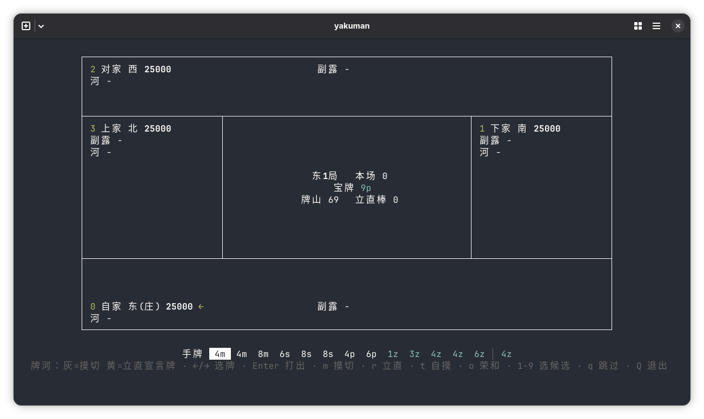

# yakuman

[examples/tui.ts](examples/tui.ts)（`yarn tui`）



## 快速开始

```ts
import { Mahjong } from 'yakuman'

const mahjong = new Mahjong()
for await (const step of mahjong.steps()) {
  if (step.type === 'roundEnd') {
    console.log(step.end.type, mahjong.score)
    if (!step.canContinue) break
    continue
  }
  for (const slot of step.slots) {
    const decision = decide(slot)
    if (step.apply(slot.ctx, decision)) break
  }
}
```

## License

[MIT](LICENSE)
